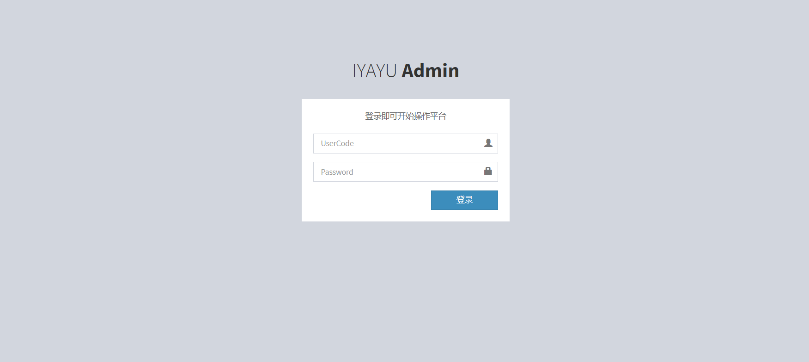
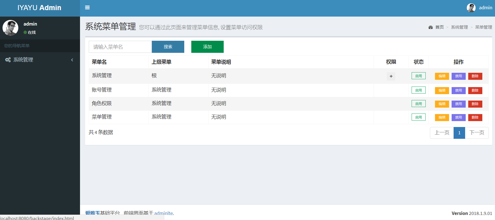
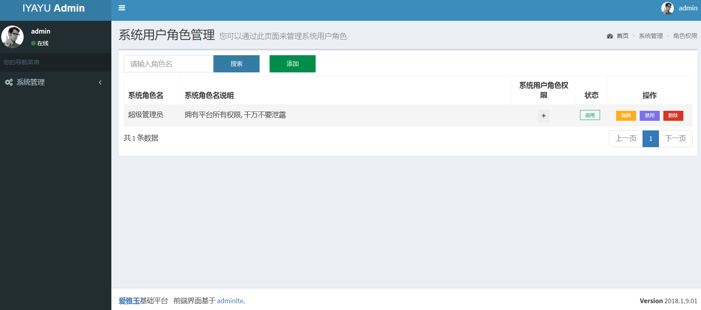
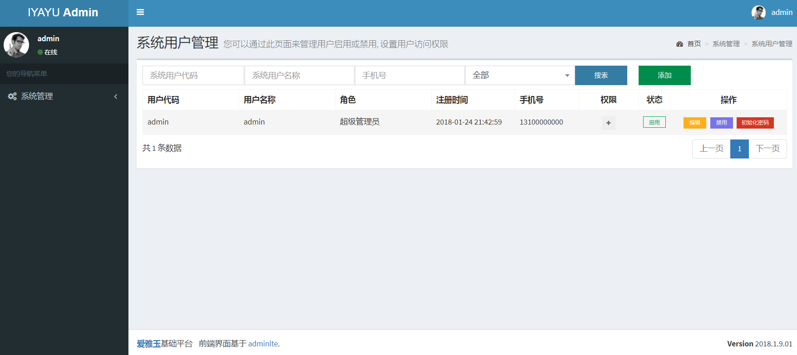

# IyyBasis 简介
爱雅玉(iyayu) 基础工程, 非常简洁的一个工程, 同时也满足您的私人定制需求.

# 我用到的技术
## 后端技术
技术 | 名称 
----|------
Spring Framework | 容器  
SpringMVC | MVC框架  
Apache Shiro | 安全框架  
MyBatis | ORM框架  
Log4J | 日志组件  
Maven | 项目构建管理  
flywaydb | 数据库版本管理  

## 前端技术
技术 | 名称 
----|------
jQuery | 函式库  
Bootstrap | 前端框架 
Bootstrap-table | Bootstrap数据表格  
Select2 | 选择框插件  
jquery-confirm | 弹出窗口插件 
layer | jQuery弹出层插件
admin lte | 管理系统模板  

## 开发工具:
- IntelliJ IDEA: 开发IDE
- MySql: 数据库
- Navicat for MySQL: 数据库客户端
- Tomcat: 开发服务器
- Git: 版本管理
- Nginx: 反向代理服务器

## 开发环境：
- Jdk7+
- Mysql5.5+

## 运行图

